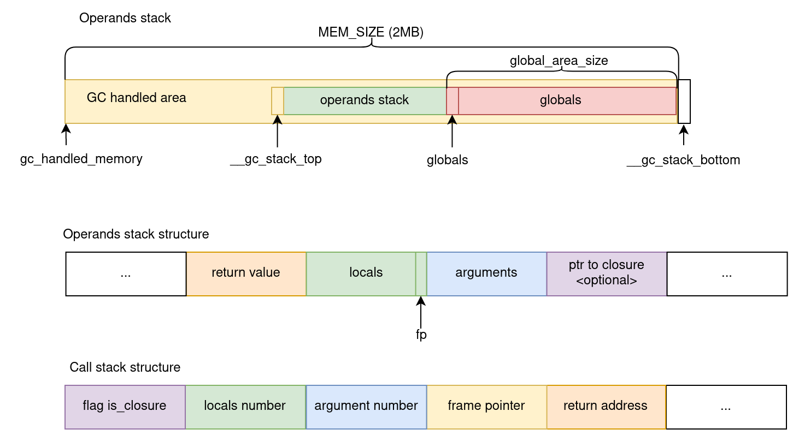

# Interpreter of Lama bytecode

Implementation of iterative interpreter of Lama bytecode.

## Project structure

Folders `lama-v1.20` with files from Lama repository (v 1.20):

* `runtime` - Lama runtime: GC, helping functions
* `byterun` - Lama bytecode disassembler. From there, the bytecode representation in C was used. 

## Useful compiler features

The compiler generates bytecode of `.lama` files with the `-b` option:

```
lamac -b <file_name>.lama
```

Pretty print for bytecode:

```
./lama-v1.20/byterun/byterun <file_name>.bc
```

## Tests 
* `regression` - test for interpreter correctness. Running tests:

```make test```

* `performance` - test on performance. Running the same program for iterative interpreter and default lama recursive interpreter, stack machine interpreter and compiled binary file. Results stored in `benchmarks.txt` file. Run benchmarks:

```make performance```

## Realization: stacks 
There are two program stack: 

* **operand stack** stores arguments, local variables and return value. Use place handled by Lama gc between pointers [`__gc_stack_top`, `__gc_stack_bottom`).
* **call stack** stores return address, number of function arguments and locals. Only the return address and numbers are there, so we don't need to manage them with GC.

