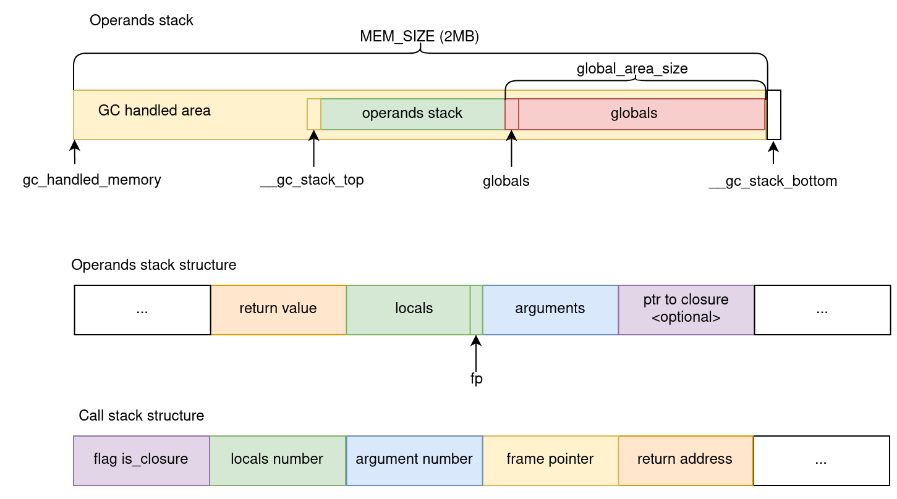

# Interpreter of Lama bytecode

Implementation of iterative interpreter of Lama bytecode.

## Build 
Command `make` build `iterinter` file in `/build` folder.

## Tests 
* `regression` - test for interpreter correctness. Running tests:

```
make test
```

* `performance` - test on performance. Running the same program for iterative interpreter and default lama recursive interpreter, stack machine interpreter and compiled binary file. Results stored in `benchmarks.txt` file. Run benchmarks:

```
make performance
```

## Realization: stacks 
There are two program stack: 

* **operand stack** stores arguments, local variables and return value. Use place handled by Lama gc between pointers [`__gc_stack_top`, `__gc_stack_bottom`).
* **call stack** stores return address, number of function arguments and locals. Only the return address and numbers are there, so we don't need to manage them with GC.

